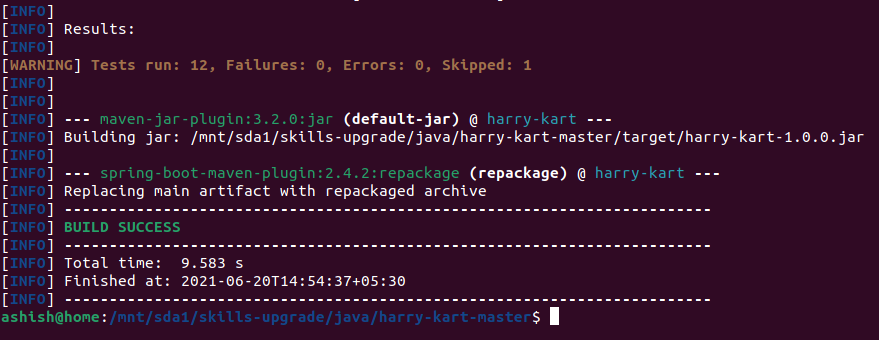

# Harry-Kart
## Description
Harry-Kart in a special kind of horse racing.

The horses participating have a base speed, they can run with that speed indefinitely.
The track is a 1000 meters loop and is divided in lanes, each horse runs on a lane and every lane has the same length.   
The horses run the first loop at their base speed but at the end of each loop they find a power-up or power-down.

The power-ups/downs are numbers, negative or positive, representing how much the horse speeds up or slows down.

This service computes the top 3 rankings for a race.

## Example 1

### Input

**Number of loops:** 3

**Start List:**

| Lane | Horse name     | Base speed |
|------|----------------|------------|
| 1    | TIMETOBELUCKY  | 10         |
| 2    | CARGO DOOR     | 10         |
| 3    | HERCULES BOKO  | 10         |
| 4    | WAIKIKI SILVIO | 10         |

**Power-Ups/Downs:**

| Loop | Lane 1 | Lane 2 | Lane 3 | Lane 4 |
|------|--------|--------|--------|--------|
| 1    | 1      | 1      | 0      | -2     |
| 2    | 1      | -1     | 2      | -2     |

### Result

| Position | Horse Name    |
|----------|---------------|
| 1st      | TIMETOBELUCKY |
| 2nd      | HERCULES BOKO |
| 3rd      | CARGO DOOR    |

## Implementation
The service is implemented as a Spring Boot application using Java. This section details the tools and technologies used
to build the app.

#### Technologies Used
* Java 15
* Spring Boot 2.4.2
* Spring 5.3.3
* Maven 3.8.1
* Swagger 2.0
* Docker 20.10.6
* Junit 5.x
* Mockito 3.x
* Jax-RS 2.11
* JaxB 2.3.1

#### Installation Guide
Below are the installation steps for the service.

1. Navigate to the project directory and run
````shell
mvn clean package
````

This will create *harry-kart-1.0.0.jar* in target directory

2. Jar can be run using
```shell
java -jar target/harry-kart-1.0.0.jar
```
3. This will publish the service on below URL with http method POST
```text
http://localhost:8080/java/api/play
```
4. Example requests
- [Race 1](./src/main/resources/input_0.xml)
- [Race 2](./src/main/resources/input_1.xml)
- [Race 3](./src/main/resources/input_2.xml)

5. Optionally you can containerize the service using docker. To create docker image,
```shell
docker build -t harry-kart-racing:latest -t harry-kart-racing:1.0.0 .
```

6. To run docker container for the image create above, run,
```shell
docker run harry-kart-racing --name harry-kart-racing -p 8080:8080
```

7. The output will be a json document of this form:
```json
{
   "ranking": [
      {"position": 1, "horse": "TIMETOBELUCKY"},
      {"position": 2, "horse": "HERCULES BOKO"},
      {"position": 3, "horse": "CARGO DOOR"}
   ]
}
```

8. Swagger UI is available at
```text
http://localhost:8080/swagger-ui.html#
```
#### Note
```note
If run docker container and unable to connect to service on localhost, use 
below command to get the IP of container
    
    docker inspect [Container Name]
```